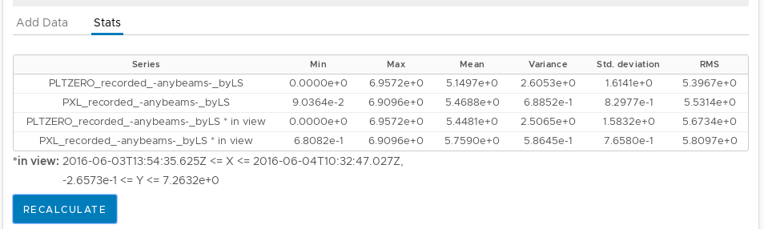

Luminosity inspector
====================

Brilview application has a total luminosity inspector component for plotting
total luminosity values. This component is currently the default view you see
when you visit Brilview application.

Total luminosity component is meant for querying total luminosity from brilcalc
and visualizing it in 3 types of charts:

* Luminosity values - :ref:`lumi-values`
* Cumulative luminosity - :ref:`cumulative`
* Luminosity ratios - :ref:`ratios`

Charts can be shown/hidden by toggling the switches at the bottom of the page
(see image bellow).

.. image:: _static/img/totlumi/toggles.png

Querying
--------

Data queries are performed using Query panel at the top of the page.

.. image:: _static/img/totlumi/query.png

Fill in fields in "Time range" and "Options" sections, and hit "QUERY" button.
Next to the button there is a status indicator which also shows error messages
in case of failed queries. After successful query, new data is stored in memory
(see :ref:`memory`).

.. note:: Normtag field accepts single iovtag, or multiple comma separated
          iovtags.

.. _memory:

Memory
------

Memory is an in-browser cache for queried data. It holds up to 10 query results
(dropping the oldest ones when full). Chart containers access this memory to
pick data for plotting. To inspect current memory switch to "Memory" tab at the
top of the page (see image bellow).

.. image:: _static/img/totlumi/memory.png

From this "Memory" tab you have ability to:

* remove results from memory

  * all at a time with "REMOVE ALL" button
  * or one by one with "remove" button next to each result

* download CSV file for each result by clicking "csv" button next to it

.. _lumi-values:

Luminosity values chart
-----------------------

This chart displays plain queried data values. In contrast to other charts, this
one is automatically populated (if possible) with recorded luminosity data after
successful query. You can also add series manually from memory using form in the
"Add series" tab at the bottom of chart container.

.. _cumulative:

Cumulative luminosity chart
---------------------------

This chart works almost the same as plain luminosity chart (see
:ref:`lumi-values`) and the only difference is that it recalculates values to
add up with time for each series. Use form in the "Add series" tab at the bottom
of chart container to add series.

.. _ratios:

Luminosity ratios chart
-----------------------

This chart is for plotting ratios between two series of data. Using form at the
bottom of chart container choose (manually from dropdowns, or by cycling
permutations with two arrow buttons) two data series from memory to make ratio
and click "ADD RATIO" button. When adding series, timestamps of data points
might be slightly modified to align lumisections.

.. _stats:

Stats
-----

Few statistical numbers for data of each chart can be calculated by clicking
"RECALCULATE" button in "Stats" tab at the bottom of chart container (see image
below). Numbers are calculated twice per each series: for whole series data, and
for data only falling in visible (zoomed) chart area.

.. _common:

Common chart controls
---------------------

For all charts in this total luminosity component there are few common controls.
The common controls are placed immediately bellow each chart (see image bellow).

Controls:

* **Chart height**: chart height in pixels
* **Chart type**: how chart is drawn - lines, bars, dots, etc.
* **Log Y axis**: should Y axis be of logarithmic or linear scale
* **FILL separators**: put vertical lines on FILL number change
* **RUN separators**: put vertical lines on RUN number change
* **CLEAR CHART**: remove all series from chart
* **POP SERIES**: remove single last series from chart

In chart navigation
^^^^^^^^^^^^^^^^^^^

.. image:: _static/img/totlumi/chart-nav.gif

Useful chart navigation methods:

* **Mode bar "Zoom Y axis 0;3" button**: shortcut to set Y axis range 0-3
  (useful for ratios)
* **Mode bar "Zoom in"/"Zoom out" buttons**: zoom in/out
* **Click and drag with "Zoom" tool selected**: zoom to region
* **Double click axis scale**: auto reset zoom for the axis
* **Click and drag axis scale edge**: zoom by by "squashing"/"expanding" from
  the edge
* **Click and drag axis scale (center)**: pan horizontally/vertically
* **Click and drag with "Pan" tool selected**: pan freely
* **Double click on chart canvas**: auto reset zoom to fit everything

.. _chart-edit:

Editable charts
---------------

Chart title, axis titles, and series names can be modified by clicking on them
and typing new text (see image bellow).

